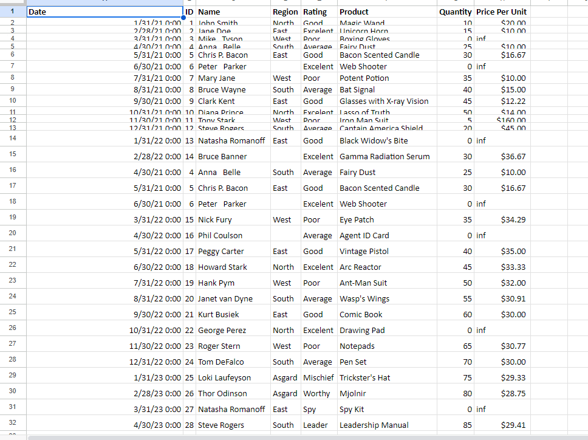
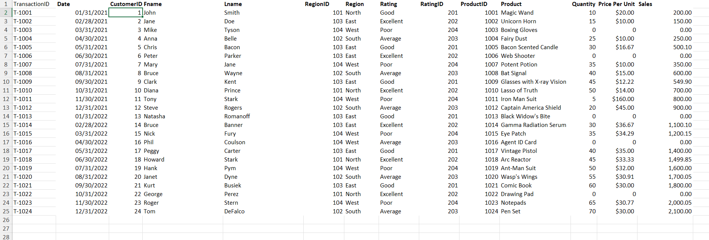
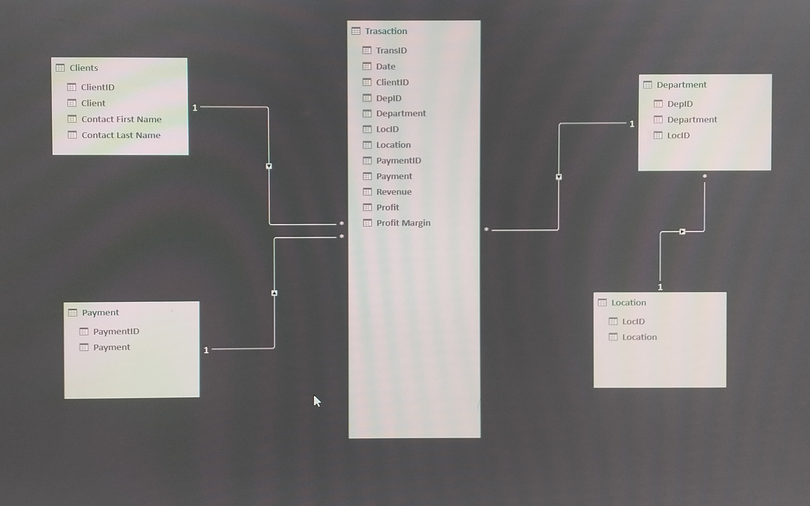

# Midterm Task 1 - Data Cleaning and Preparation using Excel
In this activity, we cleaned an excel sheet fill of errors and redundancy using different excel features.
## Step 1 DATA CLEANING
- Load the raw file
- Fit Column and row width and height
- TRIM extra spaces
- Remove NULL values
- Remove Duplicates
## Step 2 DATA NORMALIZATION
- Performed 1NF
- Perform Table split using 2NF
- Perform 3NF
- Mapped the Normalized Tables as a Physical Data Model
## Step 3 BEFORE

## Step 4 AFTER

## Here's the Physical Data Model

